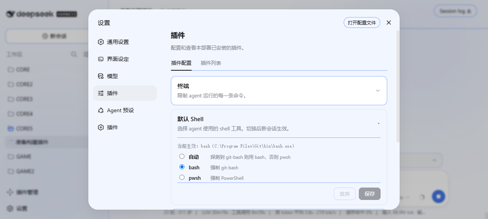
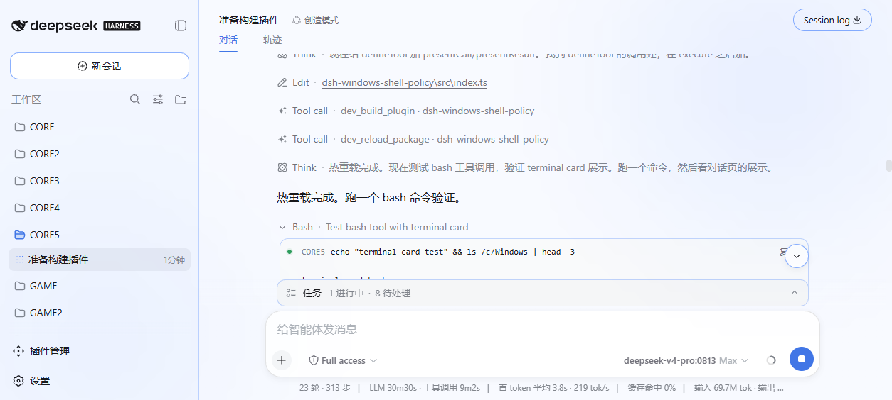

# dsh-windows-shell-policy — Windows 默认 Shell 策略插件

中文 | [English](README.en.md)



[](https://www.npmjs.com/package/@dsh-external/dsh-windows-shell-policy)
[](https://www.npmjs.com/package/@dsh-external/dsh-windows-shell-policy)
[](https://github.com/LAN-TINA-WS/dsh-windows-shell-policy/releases/latest)
[](https://github.com/LAN-TINA-WS/dsh-windows-shell-policy/releases)
[](https://github.com/LAN-TINA-WS/dsh-windows-shell-policy)
[](LICENSE)

## dsh-windows-shell-policy

DeepSeek Harness 的 **Windows 默认 Shell 策略插件**：DSH 在 Windows 上默认启用 PowerShell（pwsh），而 LLM 训练语料中 bash 占比远高于 PowerShell，agent 执行 POSIX 命令时错误率显著升高。本插件探测 git-bash/MSYS2/Cygwin，在「设置 → 插件 → 插件配置」提供「默认 Shell」折叠卡片一键切换 bash/pwsh，动态注册 bash 工具并裁剪提示词工具面，让 agent 只面对一个 shell 工具。

> [最新 Release](https://github.com/LAN-TINA-WS/dsh-windows-shell-policy/releases/latest) · [dsh-plugin 生态](https://github.com/topics/dsh-plugin) · [反馈](https://github.com/LAN-TINA-WS/dsh-windows-shell-policy/issues/1)

## 成品展示



| 能力 | 说明 |
| --- | --- |
| bash 探测 | 显式 `bashPath` → Git 常见安装路径（Program Files / x86）→ MSYS2 / Cygwin → PATH，找到即用 |
| 配置面板 | 「默认 Shell」折叠卡片（与官方「终端 / Agent 循环 / 网页搜索」卡片同构），显示探测状态与当前生效 shell，自动 / bash / pwsh 三选一（staged 编辑 + 保存/放弃，折叠时保留未保存标记） |
| 策略生效 | `auto` 时探测到 bash 则用 bash 否则 pwsh；显式 `bash` / `pwsh` 强制对应 shell；切换下一次请求生效 |
| bash 工具 | effective=bash 时动态注册（git-bash 执行，subprocess 通道，超时 / 输出截断 / exit code 标记），终端卡片展示（对话页可点击查看命令、cwd、输出与 exit 状态，与官方 shell 工具一致） |
| 提示词裁剪 | `system-prompt/assemble` 中按策略隐藏 pwsh / bash，agent 工具面只保留一个 shell 工具 |
| 持久化 | `preferred` 写入 settings 文档 `shell-policy` section，重启保留 |
| 卸载即净 | `dsh plugin --profile web remove` 或 `dev_uninject_plugin` 一键还原（工具注销 + 提示词恢复 + junction 清理） |

## 快速安装

**GitHub 直装（推荐，国内网络最快，免等 npm）**：

```sh
dsh plugin --profile web add github:LAN-TINA-WS/dsh-windows-shell-policy
# 重启 dsh web，打开「设置 → 插件 → 插件配置」开始配置
```

**npm 安装（一条命令）**：

```sh
dsh plugin --profile web add @dsh-external/dsh-windows-shell-policy
```

**Release ZIP 安装**：

1. 从 [Releases](https://github.com/LAN-TINA-WS/dsh-windows-shell-policy/releases/latest) 下载 `dsh-windows-shell-policy-v*.zip` 并解压
2. `dsh plugin --profile web add link:<解压目录>`
3. 重启 `dsh web`，打开「设置 → 插件 → 插件配置」开始配置

**注入器安装（免重启，开发环境）**：

```sh
DSH_CHECKOUT=<checkout> bash scripts/build.sh   # 产出 lib/index.js + lib/client.js
dev_inject_plugin <本目录>                      # host+UI 即时生效
```

## 配置指南

「设置 → 插件 → 插件配置」内展开「默认 Shell」卡片：

| 选项 | 行为 |
| --- | --- |
| 自动 | 探测到 git-bash 则用 bash，否则回落 pwsh（开箱即用） |
| bash | 强制 git-bash（未探测到 bash 时回落 pwsh 并提示） |
| pwsh | 强制 PowerShell（维持 DSH 默认行为） |

切换保存后下一次请求生效；`preferred` 持久化于 settings 文档 `shell-policy` section，重启保留。显式 bash 路径可通过 settings.yaml 的 `shell-policy.bashPath` 配置（面板编辑在规划中）。

## 反馈

问题、需求、使用体验：提交到 [issue #1（欢迎反馈）](https://github.com/LAN-TINA-WS/dsh-windows-shell-policy/issues/1)。

## 贡献者

| 贡献者 | 贡献 |
| --- | --- |
| [LAN-TINA-WS](https://github.com/LAN-TINA-WS) | 项目作者与维护者 |

## License

本项目采用 [MIT License](LICENSE)。

## 开发者文档

开发工艺（编写规范、DSH 能力清单、组合插件转正流程）见 [docs/](docs/)：

| 文档 | 内容 |
| --- | --- |
| [conventions.md](docs/conventions.md) | 插件编写规范与常见失败速查 |
| [capabilities-host.md](docs/capabilities-host.md) | DSH Host 服务/事件清单（本插件用到的） |
| [capabilities-client.md](docs/capabilities-client.md) | DSH Client 槽位/服务清单（本插件用到的） |
| [roadmap-composition.md](docs/roadmap-composition.md) | 组合插件转正施工记录 |

仓库结构：`src/`（host + client 源码）、`scripts/`（构建）、`docs/`（文档与截图）、`cordis.patch.yml`（bundle patch 装配）。
